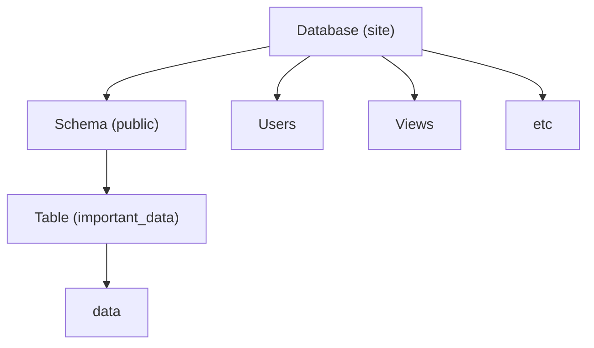

## Steps
1. Install python and minikube
2. Start minikube: `minikube start --driver docker` 
3. Prepare a virtual environment: `python -m venv venv`
4. `pip install flask "psycopg[binary]" python-dotenv`
5. Start the database: `docker compose up -d postgres-db`
6. Obtain the docker container ID: `docker ps`
7. Run a shell in the container: `docker exec -it <ID> /bin/bash`
8. Connect to the postgres shell `psql -U postgres`
9. Switch to the site database: `\c site`
10. Create a table in the database. Refer to [postgres-init.sql](./postgres-init.sql) for sample SQL commands.
11. Check the table's existence: `\dt`
12. Integrate the database with the API and test it
13. Build the API docker image by hand: `docker build -t devopsdemo:latest .`
14. Run the `devopsdemo` image, either by hand with `docker run` or via compose as a new service
15. Move the build command into the docker-compose service
16. Run the new compose service: `docker compose up -d site`


## Postgres Structure


## Errata
- Added a volume to persist postgres data in the docker compose:
```yml
<snip>
postgres-db:
    volumes:
        # /var/lib/postgresql/data is the location of the actual database files
        - pg-data:/var/lib/postgresql/data
<snip>
volumes:
    pg-data:
```

- Postgres will load the init file on startup **only** if there is no data in the DB
- Healthcheck should specify the condition to wait for:
```yaml
depends_on:
    postgres-db:
        condition: service_healthy
```
